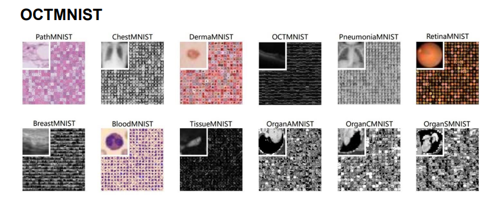

## OCTMNIST Classification using Neural Network

### Overview
In this project, we classify OCTMNIST images using a Neural Network. The OCTMNIST dataset consists of 109,309 optical coherence tomography (OCT) images for retinal diseases, each being 28x28 pixels and belonging to one of four classes.

### Steps

#### Data Acquisition:

* Install the dataset using: pip install medmnist

#### Data Preprocessing:

* Load and preprocess the OCTMNIST dataset.
* Normalize the images.
* Split the dataset into training, validation, and testing sets.

#### Model Design:

* Implement a convolutional neural network (CNN) for image classification.
* Use layers such as convolutional layers, batch normalization, ReLU activations, pooling layers, and fully connected layers.

#### Training the Model:

* Train the CNN on the OCTMNIST dataset.
* Monitor the training and validation loss and accuracy.

#### Evaluation:

* Evaluate the model on the test set.
* Report metrics such as accuracy, precision, recall, and F1 score.
* Plot training and validation accuracy/loss over epochs.
* Generate a confusion matrix.

### Technologies Used
1. Python
2. PyTorch
3. MedMNIST
4. Matplotlib
5. NumPy

### Contact

If you have any questions or comments, feel free to contact me on [Email](mailto:achadharma333@gmail.com)
